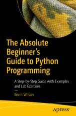

# Apress Source Code

This repository accompanies [*The Absolute Beginner's Guide to Python Programming*](https://link.springer.com/book/10.1007/978-1-4842-8716-3) by Kevin Wilson (Apress, 2022).

[comment]: #cover

Download the files as a zip using the green button, or clone the repository to your machine using Git.

## Video Resources
We are developing some procedure demonstrations and tutorials for Python as described in the accompanying book *The Absolute Beginner's Guide to Python Programming*. For more details see link https://www.elluminetpress.com/resources/python/

## Contributions

See the file Contributing.md for more information on how you can contribute to this repository.

## Errata & Updates

See the file errata.md for more information on updates and corrections.
